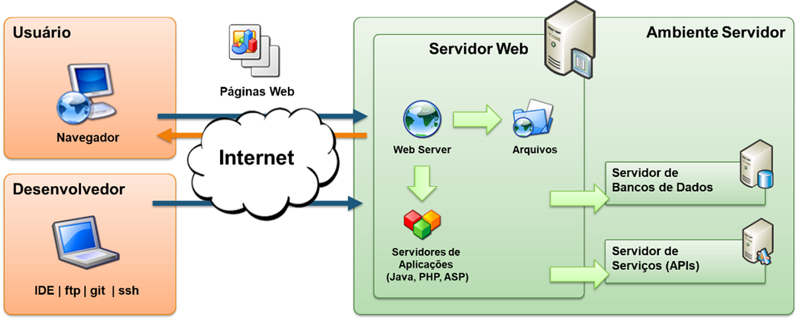
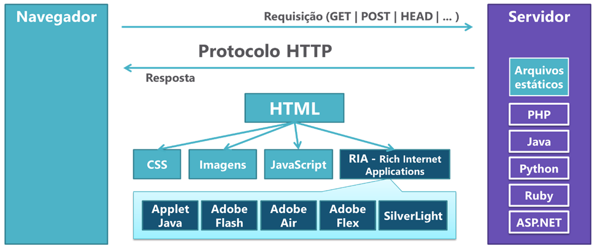
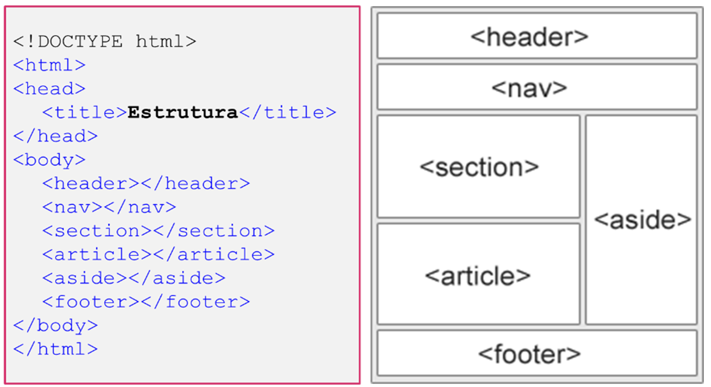
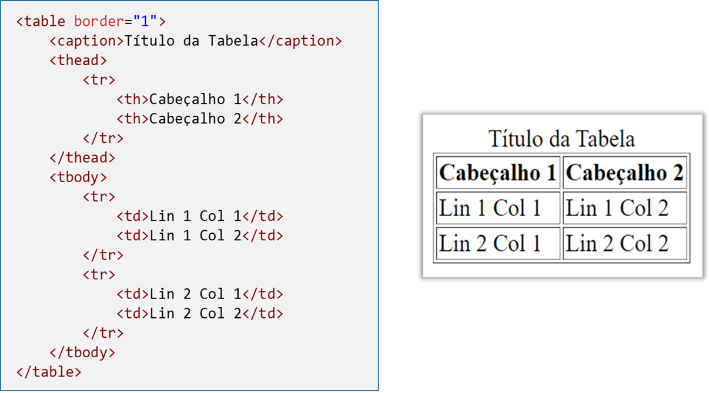

# Notas Desenvolvimento Web Front-end (PUC Minas)
<!--ts-->
- [Os padrões da web](#os-padrões-da-web)
    - [Documentação do W3C](#documentação-do-w3c)
- [Arquitetura Web](#arquitetura-web)
    - [Modelo Cliente-Servidor](#modelo-cliente-servidor)
    - [Internet](#internet)
    - [Protocolo HTTP](#protocolo-http)
    - [URI](#uri)
    - [URL](#url)
    - [URN](#urn)
    - [Servidores Web](#servidores-web)
        - [Funções do web server](#funções-do-servidor-web)
- [HTML](#html)
    - [HTML e CSS - associando](#html-e-css---associando)
    - [Estrutura do documento - Cabeçalho](#estrutura-do-documento---cabeçalho)
    - [Listas](#listas)
    - [Imagem](#imagem)
    - [Link](#link)
    - [Elementos estruturais](#elementos-estruturais)
    - [Tabelas](#tabelas)
    - [Formulários](#formulários)


<!--te-->

***
## WWW - World Wide Web
>Sistema de informação interligado por hipertexto.

- [What is Web 2.0 - O'Reily Media, 2005](https://www.oreilly.com/pub/a/web2/archive/what-is-web-20.html)

# Os padrões da web

Entre os padrões mantidos pelo [W3C](https://www.w3.org/standards/), podemos citar:

- Design e Aplicações Web (HTML, CSS, SVG, Ajax, Acessibilidade);
- Arquitetura da Web (Protocolo HTTP, URI);
- Web Semântica (Linked Data - RDF, OWL, SPARQL);
- Web Services (SOAP, WSDL);
- Tecnologia XML (XML, XML Schema, XSLT);
- Navegadores e ferramentas de autoria.

## Documentação do W3C

O W3C estabelece um processo rigoroso para a manutenção dos padrões mantidos pela organização. Um padrão passa pelos seguintes estágios antes de ser liberado formalmente para o mercado:

- Working Draft (WD);
- Candidate Release (CR);
- Proposed Recomendation (PR);
- Recomendation (REC).

# Arquitetura Web

## Modelo Cliente-Servidor

- Cliente requisita por meio `URI`;
- Servido corresponde por meio do protocolo `HTTP`.

## Internet

É uma rede mundial de computadores baseada no protocolo TCP/IP, em que todo computador conectado é denominado host (hospedeiro) e possui um identificador endereço `IP` (Internet Protocol) no padrão A.B.C.D (ex: 200.20.15.22). `DNS` troca os números para um nome legível pelo usuário (ex: www.google.com).

A `URL` (Uniform Resource Locator), é um texto codificado que traz todos os detalhes sobre o recurso solicitado pelo ambiente cliente. A URL, é um tipo de `URI` (Uniform Resorce Identifier), padrão utilizado na Internet para referenciar recursos dos mais diversos tipos como páginas, imagens, vídeos, até pessoas, produtos e outras entidades. A URI, seja uma URL ou uma URN, funciona tal qual o CPF para pessoas.


## Protocolo HTTP

`HTTP` é a forma como clientes e servidores se comunicam na rede. As requisições e as respostas obedecem aos padrões estabelecidos pelo protocolo HTTP.

A requisição `HTTP` é um pacote de dados enviado através da Internet pelo Cliente Web para o Servidor Web e identifica o recurso solicitado e como ele deve ser entregue. A resposta `HTTP` é formada por pacotes de dados enviados pelo `Servidor Web` para o `Cliente Web` com o recurso solicitado.

Esse processo são conduzidos os seguintes passos:

- Usuário informa a URL pelo cliente. Ex.: http://www.exemplo.com.br.
- O cliente monta uma requisição HTTP e encaminha ao servidor.
- O servidor recebe a requisição, processa e envia uma resposta ao cliente.
- A resposta é recebida e interpretada pelo cliente, o resultado é exibido para o usuário.

Para páginas HTML, novas requisições são feitas para outros objetos que podem ser necessários para a apresentação adequada da página como imagens, arquivos JavaScript, arquivos CSS, entre outros.
Dessa forma, podemos descrever o protocolo HTTP como um conjunto de regras que definem como as requisições e as respostas devem ser montadas de tal forma que o servidor possa entender o que o cliente está requisitando e como e, também, o cliente possa entender aquilo que é devolvido pelo servidor.

>[HTTP - Mozilla.org](https://developer.mozilla.org/pt-BR/docs/Web/HTTP)

>[RCF 2616 - Hypertext Transfer Protocol - HTTP/1.1](https://www.rfc-editor.org/rfc/rfc2616)

## URI

`URI` (Uniform Resource Identifier) é um padrão para o endereçamento de recursos disponíveis na rede que engloba os conceitos de `URL` (Uniform Resource Locator) e `URN` (Uniform Resource Name).

## URL

O URL (Uniform Resource Locator) é um padrão de URI que serve para referenciar um recurso e sua localização, normalmente na Internet. O URL é composto pelas seguintes partes:

- Esquema – identifica a forma de interação entre um cliente e um servidor, como por exemplo, http, https, ftp, entre outros;
- User:pass – informações de usuário;
- Host – nome ou número IP onde se encontra a aplicação servidor;
- Porta – identifica a porta TCP/IP associada ao servidor. A porta padrão do HTTP (80) pode ser omitida;
- Caminho – indica o local exato onde o recurso se encontra;
- Query – dados não hierárquicos, detalhando a consulta normalmente sob a forma de pares nome e valor;
- Fragmento – identifica uma seção no recurso.

## URN

O `URN` (Uniform Resource Name) é um tipo de `URI` que identifica um recurso específico (NSS) pelo nome em um namespace (NID), sem expressar a sua localização. No exemplo “urn:isbn:978-1-491-91866-1”, utilizamos a `URN` para identificar um livro a partir do seu código de ISBN, sem dizer onde esse livro está localizado.


>[Identificando recursos da web - Mozilla.org](https://developer.mozilla.org/pt-BR/docs/Web/HTTP/Basics_of_HTTP/Identifying_resources_on_the_Web)

# Servidores Web

Um site da Internet tem seus arquivos e todas as demais informações mantidas em um ambiente servidor que é responsável, em primeira instância, por servir essas informações para os usuários que requisitam o referido site. O ambiente servidor pode ser composto por várias peças, mas a principal delas é um software ou programa denominado Servidor Web. Este software é o responsável por processar a requisição feita por um cliente Web (navegador da Internet ou outra aplicação qualquer) e prover os recursos solicitados. A imagem a seguir apresenta em mais detalhes a arquitetura da Web com foco no ambiente Servidor.



## Funções do Servidor web

- Atender requisições HTTP e processar repostas.
- Gerenciar múltiplos sites (Domínios, IPs e Portas).
- Gerenciar arquivos dos sites (File System).
- Integrar com mecanismos de scripts: PHP, PERL, ASPX, Ruby, Python, etc.
    - Autenticação básica ou digest (Protocolo HTTP)
    - Integração com servidores de autenticação (Microsoft Active Directory, LDAP Servers, Radius Servers)
- Implementar a criptografia na comunicação: HTTPS - TLS/SSL.
- Cache de recursos.
- Auditoria (Logs de acesso, sistema e erros).

>[O que é um servidor web (web server) - Mozilla.org](https://developer.mozilla.org/pt-BR/docs/Learn/Common_questions/What_is_a_web_server)

***
# HTML




## Estrutura de um documento HTML
```html
<!DOCTYPE html>
<html>
    <head>
        <meta name="author" content ="name"> <!--contém atributos-->
    </head>
    <body>
        <h1> título </h1>
        <p> parágrafo </p>
    </body>
</html>
```

- Elementos: `<tag>` conteúdo `</tag>` | tag de abertura e tag de fechamento

- Atributos: `nome`=`"valor"`

>O `DOCTYPE` indica ao browser qual a versão do HTML está sendo utilizada no documento, alternando entre `quirks mode` e `strict mode`
- HTML5
    - `<!DOCTYPE html>`
- HTML 4.01
    - `<!DOCTYPE HTML PUBLIC "-//W3C//DTD HTML 4.01 Transitional//EN">`
- HTML 1.0
    - `<!DOCTYPE html PUBLIC "-//W3C//DTD XHTML 1.0 Transitional//EN"
"http://www.w3.org/TR/xhtml1/DTD/xhtml1-transitional.dtd">`

## HTML e CSS - associando

- HTML

```html
...
<h1 id="titulo1" class="noticias">
    Título
</h1>
```
- CSS

```css
/* pelo nome do elemento */
h1 {
    color: red;
}
/* pelo ID do elemento*/
#titulo1 {
    font-size: 33px;
}
/* pela classe do elemento*/
.noticias {
    font-family: arial;
}
```

## Estrutura do documento - CABEÇALHO

- Representada pela tag `<head>`, que inclui os metadados, referências, estilos...

```html
<!DOCTYPE html>
<html lang="pt-br">
    <head> <!-- Cabeçalho -->
        <title>Exemplo</title>
        <meta charset="UTF-8">
        <meta name="author" content ="Geraldo Homero">
        <meta name="descripton" content="teste e exemplo de HTML">
        <meta name="keywords" content="palavra-chave, html, web, css">
        <link rel="stylesheet" href="./style.css">
        ...
        ...
        ...
    </head> <!-- Fim do Cabeçalho -->
    <body>...</body>
</html>
```

|Elementos|Tags|
|---------|----|
|Títulos| `<h1>` .. `</h1>`, `<h2>` .. `</h2>`, ... , `<h6>` ...`</h6>`|
|Paragráfos|`<p>` .. `</p>`|
|Quebra de linha| `<br>`|
|Voz alternativa (itálico)| `<i>` .. `</i>`|
|Palavra-chave (negrito)| `<b>` .. `</b>`|
|Importância|`<strong>` .. `</strong>`|
|Código fonte|`<code>` ... `</code>`|
|Texto pré-formatado| `<pre>` .. `</pre>`|
|Citações|`<blockquote>` .. `</blockquote>`|

## Listas
### Ordenada `(<ol> .. </ol>)`, não ordenada `(<ul> .. </ul)` e definições `(<dl> .. </dl>)`. 

```html
...
<ol> 
  <li> primeiro item</li>
  <li> segundo item</li>
  <li> terceiro item</li>
</ol>
...
```
>As listas de definições apresentam os itens e suas definições indentadas. Essas listas possuem elementos específicos para os termos `(<dt> .. </dt>)` e para as suas definições `(<dd> .. </dd>)`, conforme mostrado no exemplo a seguir. 

```html
...
<dl> 
  <dt> termo 01</dt>
  <dd> definição 01</dd>
  <dt> termo 02</dt>
  <dd> definição 02</dd>
</dl>
...
```

## Imagem

```html
   
```

## Link

```html
  <a href="http://linkexemplo.com" target="_blank"> Texto link exemplo </a>
```
>O atributo `target` define onde o documento apontado pelo link será aberto e aceita os valores:  

- `_blank` – para nova janela ou tab,
- `_self` – para a mesma janela – default,
- `_parent` – para a o frame pai,
- `_top` – para a janela atual inteira ou
- `nome_do_frame` – para um frame específico.

>[Free guide to HTML - htmlreference.io](https://htmlreference.io/)

>[HTML: HyperText Markup Language - Mozilla.org](https://developer.mozilla.org/en-US/docs/Web/HTML)

## Elementos estruturais

Com o HTML 5, foram criados vários elementos novos com significados específicos, porém com a mesma funcionalidade do elemento `<div>`, ou seja, agrupar outros elementos de uma página. Esses elementos, muitas vezes denominados `elementos semânticos`, trouxeram uma gama de possibilidades para o desenvolvedor. 

|Elementos|	Descrição|
|--------|-----------|
|`<article>`|	Define um artigo.|
|`<aside>`	|Define conteúdo além do conteúdo da página.|
|`<details>`|	Define detalhes adicionais que o usuário pode visualizar ou ocultar.|
|`<figcaption`>|	Define o título para um elemento `<figure>`.|
|`<figure>`|	Define um elemento autocontido como ilustração, diagramas, fotos, listagem de código etc.|
|`<footer>`|	Define um rodapé para o documento ou seção.|
|`<header>`	|Especifica o cabeçalho para um documento ou seção.|
|`<main>`|Especifica o conteúdo principal de um documento.|
|`<mark>	`|Define texto destacado.|
|`<nav>`	|Define conteúdo de navegação.|
|`<section>`|	Define uma seção em um documento.|
|`<summary>`|	Define um resumo visível para um elemento `<details>`.|
|`<time>`|Define uma data/hora.|



>[Semantic in HTML](https://htmlreference.io/semantic/)

>[Document and website structure - Mozilla.org](https://developer.mozilla.org/en-US/docs/Learn/HTML/Introduction_to_HTML/Document_and_website_structure)

## Tabelas

|Elementos|	Descrição|
|---------|----------|
|`<table>`|	Elemento que compreende toda a tabela.|
|`<caption>`|	Define o título da tabela.|
|`<thead>`|	Agrupa as linhas de cabeçalho da tabela.|
|`<tbody>`|	Agrupa as linhas de dados da tabela.|
|`<tfoot>`|	Agrupa as linhas de rodapé da tabela.|
|`<tr>`|	Define uma linha da tabela.|
|`<th>`|	Define uma célula do cabeçalho dentro de uma tag `<tr>`.|
|`<td>`|	Define uma célula de dados dentro de uma tag `<tr>`.|


[HTML - Tabela](./src/estrutura-tabela.html)

## Formulários

- `name` e `id` identificam o formulário no contexto da página;
- `action` indica qual a URL a ser disparada para processamento do formulário;
- `method` indica como o formulário será submetido via requisição HTTP (POST ou GET).


# CSS